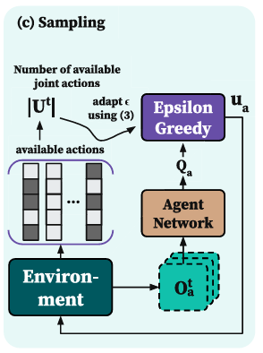
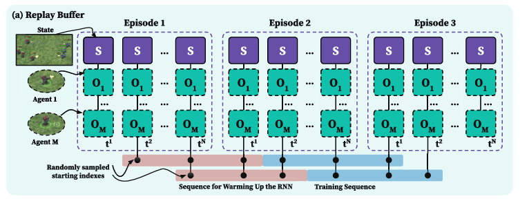

<<<<<<< HEAD
---
layout: single
title: "[논문 리뷰] Rethinking Exploration and Experience Exploitation in Value-Based MARL"
date: 2024-02-18
categories: blog
author_profile: true
permalink: /:categories/:year/:month/:day/:title/
---
# [논문 리뷰] Rethinking Exploration and Experience Exploitation in Value-Based MARL

## 논문 기본 정보
| 항목 | 내용 |
|------|------|
| 제목 | Rethinking Exploration and Experience Exploitation in Value-Based Multi-Agent Reinforcement Learning |
| 저널 | IEEE |
| 발표일 | 2025년 1월 17일 |
| 키워드 | MARL, exploration, value-based methods |

## 논문 핵심 내용 요약

### METHOD
#### 0. QMIX 기반
1. QMIX의 exploration 전략 (입실론-greedy) 개선
2. QMIX의 experience replay buffer 개선

#### 1. Exploration 전략 개선

> 기존 입실론-greedy의 한계
* 고정된 입실론 값 사용
  - 환경과 상태에 관계없이 동일한 확률로 랜덤 행동 선택
  - 환경의 복잡도나 에이전트 수를 고려하지 않음

* MARL 환경에서의 문제점
  - 에이전트 수가 변할 때마다 적절한 exploration 강도 조절 불가
  - available actions의 수가 다양한 상황에서 비효율적
  - 복잡한 협력이 필요한 상황에서 충분한 탐색이 어려움

> 제안하는 개선 방법 
* available joint actions의 수에 기반한 exploration 방법 제안
* 입실론-greedy policy 수정으로 SOTA MARL 성능 달성
* 에이전트 수에 따른 가용 joint actions 비율 고려



* 수식 <br>
$εt = tanh(α * √log(|Ut|))$
  - |Ut|: 시점 t에서 사용 가능한 joint actions의 수
1. log(|Ut|)
    - joint actions 수가 증가할 때 완만하게 증가
2. √(제곱근) 사용
    - log 값의 증가 속도를 더욱 완화
3. tanh 함수 사용
    - exploration 확률을 [0,1] 범위로 제한

#### 2. Replay Buffer 개선

> Replay Buffer의 주요 구조와 특징
* Replay Buffer란?
    - 강화학습에서 경험을 저장하고 재사용하기 위한 메모리 공간
    - transition tuples $(s_t, r_t, {(z_t^a, u_t^a, z_{t+1}^a) | a=1,...,n})$ 저장
    - 버퍼 크기 D만큼의 transitions 저장 가능

> 기존 방식의 문제점
* 전체 에피소드 기반 학습의 한계
    - 다양한 길이의 에피소드 처리 어려움
    - 에피소드 간 transition 관계 활용 못함
    - 긴 에피소드에서의 학습 비효율성
* Recurrent Network 사용 시 문제
    - hidden state 초기화 시점 설정 어려움
    - 에피소드 전체를 메모리에 유지해야 하는 부담

 > 제안하는 개선 방법
* Sequence 기반 학습 도입
    - 고정된 길이 m의 sequences 사용
    - 에피소드 경계와 무관하게 학습 가능
    - 메모리 효율성 향상

* 개선된 Replay Buffer의 장점
    * 학습 안정성 향상
        - 일관된 길이의 sequence로 학습
        - 적절한 recurrent state 초기화
        - experience 간 상관관계 감소


> 알고리즘 1
```
입력: transitions 리스트 D, buffer 크기 D
출력: 업데이트된 transitions 리스트 D

1. 길이 T의 새로운 에피소드에서 transition tuples 샘플링
2. 각 step t에 대해:

    - buffer가 가득 찼다면 (size(D) = D):
        - 가장 오래된 transition 제거

`   - 새로운 transition을 buffer에 추가
```
* 알고리즘 1의 특징
  - FIFO(First In First Out) 방식으로 메모리 관리
  - 가장 오래된 데이터부터 제거하여 최신 경험 유지
  - 에피소드 단위가 아닌 transition 단위로 관리 

> 알고리즘 2
```
입력: transitions 리스트 D, sequence 크기 m, batch 크기 B
출력: transitions batch B

1. 빈 batch B 초기화
2. batch 크기 B가 될 때까지:

    - 무작위로 시작 인덱스 i 선택
    - sequence 생성:
        - i부터 i+m까지의 transitions 선택
        - buffer 끝에 도달하면 처음부터 이어서 선택

    - 생성된 sequence를 batch B에 추가
```
* 알고리즘 2의 핵심 기능
  - 균일한 길이의 sequence 생성
  - buffer 경계를 넘어가는 상황 처리
  - recurrent state 초기화 전략 구현
    * sequence 첫 절반: state 초기화용
    * 후반 절반: 실제 학습에 사용
=======
---
layout: post
title: "[논문 리뷰] Rethinking Exploration and Experience Exploitation in Value-Based MARL"
date: 2024-02-18
categories: [Paper Review, MARL]
---
# [논문 리뷰] Rethinking Exploration and Experience Exploitation in Value-Based MARL

## 논문 기본 정보
| 항목 | 내용 |
|------|------|
| 제목 | Rethinking Exploration and Experience Exploitation in Value-Based Multi-Agent Reinforcement Learning |
| 저널 | IEEE |
| 발표일 | 2025년 1월 17일 |
| 키워드 | MARL, exploration, value-based methods |

## 논문 핵심 내용 요약

### METHOD
#### 0. QMIX 기반
1. QMIX의 exploration 전략 (입실론-greedy) 개선
2. QMIX의 experience replay buffer 개선

#### 1. Exploration 전략 개선

> 기존 입실론-greedy의 한계
* 고정된 입실론 값 사용
  - 환경과 상태에 관계없이 동일한 확률로 랜덤 행동 선택
  - 환경의 복잡도나 에이전트 수를 고려하지 않음

* MARL 환경에서의 문제점
  - 에이전트 수가 변할 때마다 적절한 exploration 강도 조절 불가
  - available actions의 수가 다양한 상황에서 비효율적
  - 복잡한 협력이 필요한 상황에서 충분한 탐색이 어려움

> 제안하는 개선 방법 
* available joint actions의 수에 기반한 exploration 방법 제안
* 입실론-greedy policy 수정으로 SOTA MARL 성능 달성
* 에이전트 수에 따른 가용 joint actions 비율 고려


* 수식 <br>
$εt = tanh(α * √log(|Ut|))$
  - |Ut|: 시점 t에서 사용 가능한 joint actions의 수
1. log(|Ut|)
    - joint actions 수가 증가할 때 완만하게 증가
2. √(제곱근) 사용
    - log 값의 증가 속도를 더욱 완화
3. tanh 함수 사용
    - exploration 확률을 [0,1] 범위로 제한

#### 2. Replay Buffer 개선

> Replay Buffer의 주요 구조와 특징
* Replay Buffer란?
    - 강화학습에서 경험을 저장하고 재사용하기 위한 메모리 공간
    - transition tuples $(s_t, r_t, {(z_t^a, u_t^a, z_{t+1}^a) | a=1,...,n})$ 저장
    - 버퍼 크기 D만큼의 transitions 저장 가능

> 기존 방식의 문제점
* 전체 에피소드 기반 학습의 한계
    - 다양한 길이의 에피소드 처리 어려움
    - 에피소드 간 transition 관계 활용 못함
    - 긴 에피소드에서의 학습 비효율성
* Recurrent Network 사용 시 문제
    - hidden state 초기화 시점 설정 어려움
    - 에피소드 전체를 메모리에 유지해야 하는 부담

 > 제안하는 개선 방법
* Sequence 기반 학습 도입
    - 고정된 길이 m의 sequences 사용
    - 에피소드 경계와 무관하게 학습 가능
    - 메모리 효율성 향상

* 개선된 Replay Buffer의 장점
    * 학습 안정성 향상
        - 일관된 길이의 sequence로 학습
        - 적절한 recurrent state 초기화
        - experience 간 상관관계 감소


> 알고리즘 1
```
입력: transitions 리스트 D, buffer 크기 D
출력: 업데이트된 transitions 리스트 D

1. 길이 T의 새로운 에피소드에서 transition tuples 샘플링
2. 각 step t에 대해:

    - buffer가 가득 찼다면 (size(D) = D):
        - 가장 오래된 transition 제거

`   - 새로운 transition을 buffer에 추가
```
* 알고리즘 1의 특징
  - FIFO(First In First Out) 방식으로 메모리 관리
  - 가장 오래된 데이터부터 제거하여 최신 경험 유지
  - 에피소드 단위가 아닌 transition 단위로 관리 

> 알고리즘 2
```
입력: transitions 리스트 D, sequence 크기 m, batch 크기 B
출력: transitions batch B

1. 빈 batch B 초기화
2. batch 크기 B가 될 때까지:

    - 무작위로 시작 인덱스 i 선택
    - sequence 생성:
        - i부터 i+m까지의 transitions 선택
        - buffer 끝에 도달하면 처음부터 이어서 선택

    - 생성된 sequence를 batch B에 추가
```
* 알고리즘 2의 핵심 기능
  - 균일한 길이의 sequence 생성
  - buffer 경계를 넘어가는 상황 처리
  - recurrent state 초기화 전략 구현
    * sequence 첫 절반: state 초기화용
    * 후반 절반: 실제 학습에 사용
>>>>>>> ce30353eb060b18f1196c7266b1e2e8c918c9fa9
